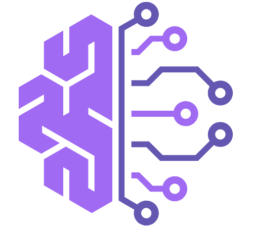

 

# Coderoad


**Coderoad** est une application web collaborative conçue pour rendre l'apprentissage du développement web plus interactif et amusant...


Créée par trois amis passionnés, l'application permet de suivre la progression de chaque utilisateur dans des défis de développement web, catégorisés en Front-End et Back-End.

## Objectif du Projet

Le but de Coderoad est de s'auto-former et de collaborer en réalisant des défis communs en développement web. Chaque utilisateur doit accomplir des défis spécifiques, marquer leur progression, et finalement appliquer les compétences acquises dans des projets pratiques.

## Fonctionnalités

- **Défis communs** : Chaque défi créé par l'administrateur est attribué à tous les utilisateurs.
- **Progression par étape** : Les défis sont divisés en deux catégories :
  - **Front-End** : Conception et développement de l'interface utilisateur (HTML/CSS/JS).
  - **Back-End** : Développement côté serveur (Symfony, API, etc.).
- **Marquage de progression** : Chaque utilisateur peut changer le statut de ses défis en "To Do", "In Progress", ou "Done".
- **Référencement des réalisations** : Après avoir terminé un défi, l'utilisateur peut soumettre le lien vers le dépôt GitHub du challenge complété.
- **Projets collaboratifs** : À la fin de plusieurs défis, un projet est proposé pour unir toutes les compétences acquises.

## Structure des Défis

Les défis sont conçus pour aborder des compétences spécifiques en développement web et sont organisés de manière à renforcer à la fois les compétences en Front-End et en Back-End. Voici un exemple de progression de défis :

1. Form 3 step : formulaire en 3 étapes
3. Slider : Slider pour faire défiler des images
4. Projet : Système d'authentification next.Js

Chaque défi est accompagné de son propre dépôt GitHub pour la validation des acquis par les utilisateurs.

## Technologies utilisées

- **Symfony 7** : Le framework PHP utilisé pour gérer la logique back-end.
- **HTML/CSS/JavaScript** : Pour les défis front-end et la conception de l'application.
- **GitHub** : Pour stocker et partager les projets et défis réalisés.

## Comment ça fonctionne

1. **Création de défis** : L'administrateur crée des défis via l'interface admin. Ces défis sont automatiquement assignés aux utilisateurs.
2. **Réalisation des défis** : Chaque utilisateur doit réaliser les défis de son côté, et marquer sa progression dans l'application.
3. **Projets collaboratifs** : Après avoir accompli une série de défis, un projet plus complexe est proposé, combinant les compétences acquises.

## Installation du projet

Clonez le dépôt :

```bash
git clone https://github.com/euroR67/coderoad.git
```
Installez les dépendances avec Composer :
```bash
composer install
```
Configurez les variables d'environnement :

Créez un fichier .env.local en vous basant sur le fichier .env et ajustez les configurations de base de données, d'API, etc.

Mettez en place la base de données :
```bash
php bin/console doctrine:database:create
php bin/console doctrine:migrations:migrate
```
Démarrez le serveur local Symfony :
```bash
symfony server:start
```
Contribution
Vous êtes invités à proposer des améliorations ou à signaler des bugs via des pull requests ou en ouvrant une issue sur GitHub.
